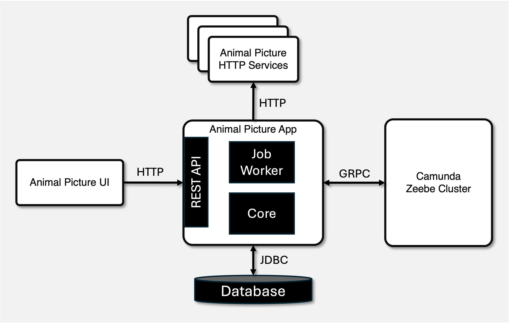

# Animal Picture Generator Spring Boot Application

This repository hosts a Spring Boot-based application and a corresponding UI to generate pictures of animals, including bears, cats, or dogs.

## Modules

The project is divided into two main modules:

### 1. Animal Picture App

This module, named `animal-picture-app`, includes the core application functionality. It generates and retrieves animal pictures, exposing these capabilities through a RESTful API endpoint. 
This enables users to programmatically generate pictures of their desired animals.

### 2. Animal Picture Frontend

The `animal-picture-frontend` module provides a simple UI to generate and view animal pictures directly from their web browser.

## Getting Started

To get started with this application, clone the repository to your local machine and follow the instructions in each module's README for setting up and running the application components.

## Overall Architecture

The architecture of the Animal Picture Generator application is depicted below.

